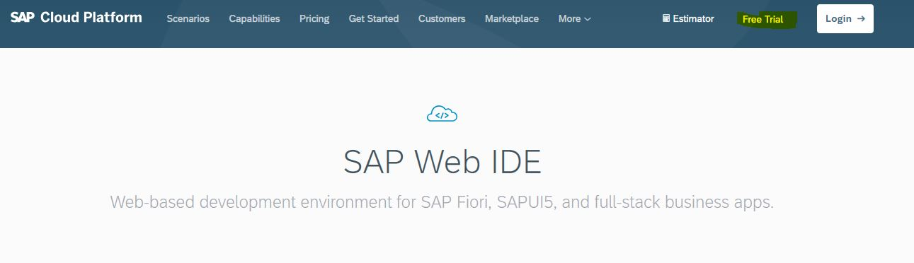
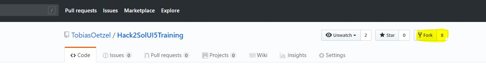
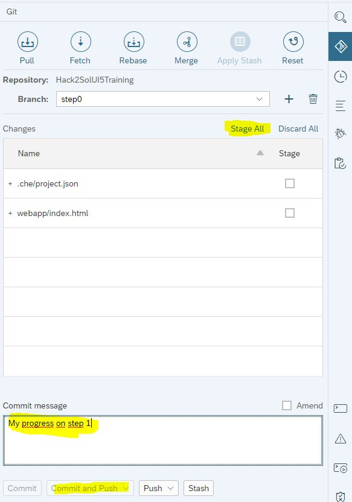
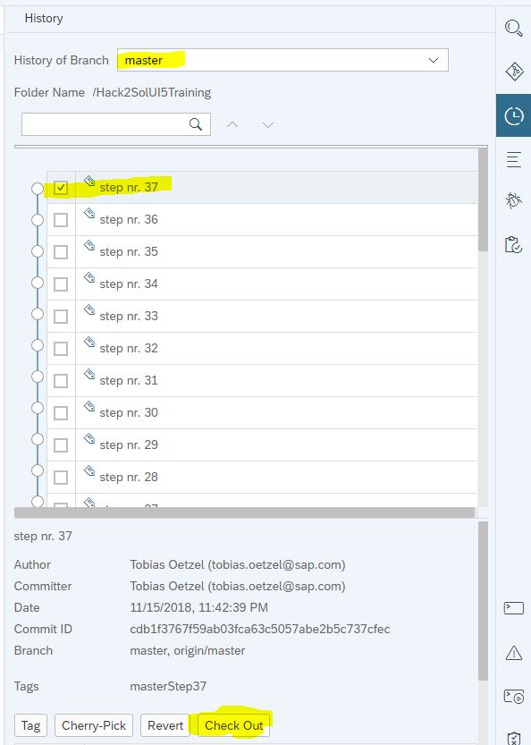

# Getting started with SAP WebIDE

1. [Create an Account](https://cloudplatform.sap.com/capabilities/product-info.SAP-Web-IDE.9e5c9d90-e8e0-4e82-aed2-09087a10c973.html)

2. Activate the account (confirm your email)

3. Launch the WebIDE

[Trial Cockpit](https://account.hanatrial.ondemand.com/cockpit/#/home/trialhome)

### Importing by downloading a zip

If you are not familiar with github you can import each step of the walkthrough.

1. Choose your step

2. Press show code

3. Download the code

4. Import the project

If you want to use real backend data (after step26) you also need to create a 
neo-app.json file in the root of the imported folder with this content: 
https://raw.githubusercontent.com/TobiasOetzel/Hack2SolUI5Training/master/neo-app.json

5. Run it!

The Walkthrough contains 4 runnable files (.html files) (Initially only one).
To run it you can select the index.html file and select "Run as Web Application".

### Initial import

1. (optional) If you want to save your progress in your own repository you can create a fork.

2. Press on "Clone from Git repository"

3. Press the Clone or download button on your fork

4. Copy the displayed Url and paste in in the dialog in the WebIDE
5. You can now [run your application](#running-the-application). Initially you are on step 35 - you can checkout step0 to start from scratch

**You are ready for the workshop now!**

### Checking out a step

1. Save all your changes by committing or stashing them. Later you can continue by checking out this branch again.

2. Switch to the history tab and double click on the checkbox of the entry you want to checkout.
Afterwards you are on a new branch and continue on this step. Make sure you select the root folder of the project to see the complete history

## Odata - Importing the destinations

Destinations are used to connect to different systems on the SAP Cloud Platform
In our walkthrough we connect to the northwind service.

1. Go to the "Destinations" in the "Connectivity" section

2. Select [northwind](../northwind) or [es4](../ES4) and save them on your harddrive
3. Press the import button
4. Edit the ES4 destination and type your user and password to avoid authentication popups.

## Running the application

The Walkthrough contains 4 runnable files (.html files) (Initially only one).
To run it you can select the index.html file and select "Run as Web Application".

