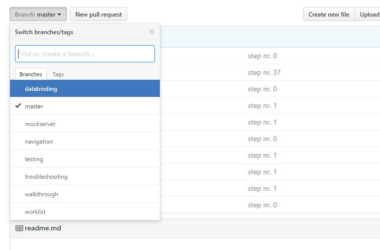

# Welcome to your UI5 Tutorial

This repository contains the steps of the official [UI5 walkthrough](https://openui5beta.hana.ondemand.com/#docs/guide/3da5f4be63264db99f2e5b04c5e853db.html).
The links below help you getting started. I recommend using the WEB IDE. If you want to play around with the result of the walkthrough you can register for the ES4 system to add a real Gateway system to your application.

This repository contains all the UI5 tutorials.
Select the tutorial you want to follow by selecting the branch.

* [Getting started with WEB IDE](docs/WebIDE.md)
* [Getting started without WEB IDE](docs/Grunt.md)
* [Registration link for the ES4 system](https://register.sapdevcenter.com/SUPSignForms/)
* [Adding the odata service (walkthrough step 26)](docs/step26.md)

Useful Links:
 * [OpenUI5 Demokit](https://openui5.hana.ondemand.com/) - UI5 docu and samples
 * [Direct link to the walkthrough](https://openui5.hana.ondemand.com/#docs/guide/3da5f4be63264db99f2e5b04c5e853db.html) - Here is where we get started
 * [UI5 Developer Center](http://scn.sap.com/community/developer-center/front-end) - Community for UI5
 * [Chrome Devtools](https://developers.google.com/web/tools/chrome-devtools/) - Debugging with Chrome
 * [UI5 troubleshooting](https://openui5.hana.ondemand.com/#/topic/615d9e4aaa34447fbd4aa5f19dfde9b8) - Debugging and logging hints for UI5
 * [DevDocs](http://devdocs.io/) - Various JS documentations in one place with offline support
 * [MDN JavaScript guide](https://developer.mozilla.org/de/docs/Web/JavaScript) - Learn JavaScript (complete guide to JS)
 * [JavaScript Garden](http://bonsaiden.github.io/JavaScript-Garden/) - Some basic concepts of javascript

